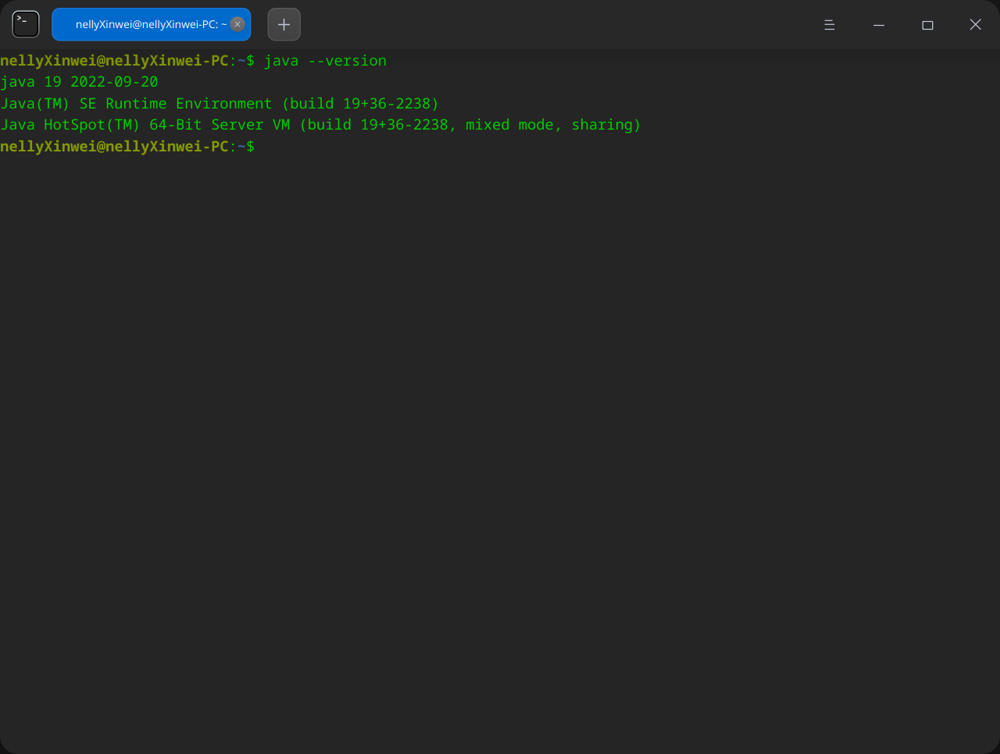
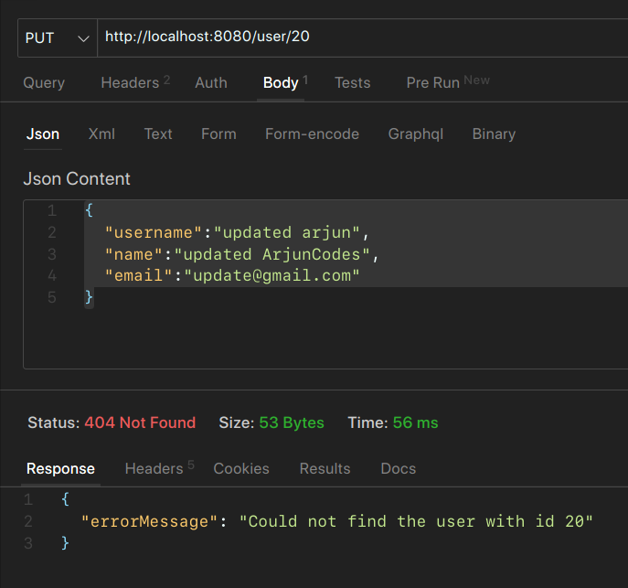

<div width="100%" align="right">

<!-- Color Palette for Session Status: https://www.color-hex.com/color-palette/35021 -->

[](https://github.com/newojima/codewitharjun-fssbrs-20220811)

</div>

<div width="100%" align="center">

# codewitharjun-fssbrs-20220811

### Full Stack Spring Boot React Series

<!-- Seasons of Japan: https://www.japanexplorer.com.au/japans-four-seasons/ -->
<!-- Autumn Color Palette Peg: https://www.schemecolor.com/autumn-in-japan-color-scheme.php -->

[](https://www.youtube.com/playlist?list=PL1oBBulPlvs84AmRmT-_3dGz4KHYuINsj)
[](https://www.youtube.com/playlist?list=PL1oBBulPlvs84AmRmT-_3dGz4KHYuINsj)
[](https://www.youtube.com/c/CodeWithArjun)

</div>


<details>
<summary><b>Course Description:</b> In this series i have shown how to create full stack CRUD ( Create, Read, Update, Delete) using Spring boot and React Hooks using Functional Components. We will build Web Services (REST API) using Spring and Mysql on Backend and Test using PostMan and handle the same REST API on react in frontend using axios. </summary>

<br/>

FullStack CRUD Playlist : https://shorturl.at/gjvDT

Source Code Link :

- Backend: https://github.com/arjungautam1/fullstack-backend
- Frontend: https://github.com/arjungautam1/fullstack-frontend

Install Java JDK

- Windows : https://youtu.be/5LRKsKZUd_k
- Linux : https://youtu.be/KiThrZiEE9g
- MacOS : https://youtu.be/FsX0_RXMwvY

Install Node JS

- Windows : https://youtu.be/n3M9qKvFZeg
- Linux : https://youtu.be/P6rPI7x28nY
- MacOS : https://youtu.be/pHz7TgEIa0w

Install MySQL

- Windows : https://youtu.be/OM4aZJW_Ojs
- MacOS : https://youtu.be/oxToe-4c6OM
- Linux : https://youtu.be/9pqYDyXklWQ

Install IntellIj

- Windows : https://youtu.be/ND9f1IRuc2Q
- MacOS : https://youtu.be/gM7SBQyKCY0
- Linux : https://youtu.be/gZ_XtkcPSHY

Install PostMan

- Windows/MacOS/Linux : https://www.postman.com/downloads/

PayPal : https://paypal.me/codewitharjun

Patreon : https://www.patreon.com/codewitharjun

➡️ Subscribe : https://www.youtube.com/codewitharjun

Stay Connected :

- ➡️ LinkedIn : https://np.linkedin.com/in/arjungautam1
- ➡️ Github : https://github.com/arjungautam1

Join Community :

- ➡️Discord : https://discord.gg/cn2x3jhMW4

Follow me on :

- ➡️ Medium: https://codewitharjun.medium.com/
- ➡️ Dev.to : https://dev.to/codewitharjun

#fullstack #CodeWithArjun #Programming

</details>

---

<details>
<summary><b>Table of Contents</b></summary>

- [codewitharjun-fssbrs-20220811](#codewitharjun-fssbrs-20220811)
    - [Full Stack Spring Boot React Series](#full-stack-spring-boot-react-series)
- [1 - Introduction](#1---introduction)
  - [1.1 - Overview](#11---overview)
  - [1.2 - Prerequisite](#12---prerequisite)
- [2 - Create Spring Boot Project and Packages](#2---create-spring-boot-project-and-packages)
  - [2.1 Java JDK](#21-java-jdk)
    - [2.1.1 Checking if you have java JDK](#211-checking-if-you-have-java-jdk)
  - [2.1.2 Installing Java JDK on Windows, Linux, and MacOS](#212-installing-java-jdk-on-windows-linux-and-macos)
  - [2.2 Spring Initializr](#22-spring-initializr)
  - [2.1.3 Creating Packages in the Spring Project](#213-creating-packages-in-the-spring-project)
- [3 - Creating Model Class and Connect with MySQL](#3---creating-model-class-and-connect-with-mysql)
  - [3.1 Installing MySQL](#31-installing-mysql)
    - [3.1.1 Linux Installation (XAMPP)](#311-linux-installation-xampp)
    - [3.1.2 Linux Installation (MySQL)](#312-linux-installation-mysql)
  - [3.2 Connecting Spring Boot App to MySQL Database](#32-connecting-spring-boot-app-to-mysql-database)
  - [3.3 MySQL Workbench](#33-mysql-workbench)
    - [3.3.1 MySQL Workbench](#331-mysql-workbench)
    - [3.3.1 MySQL Workbench on VSCode](#331-mysql-workbench-on-vscode)
  - [3.4 Running our Spring Boot Application with our connected MySQL Database](#34-running-our-spring-boot-application-with-our-connected-mysql-database)
  - [3.5 Using dotenv to store important config keys](#35-using-dotenv-to-store-important-config-keys)
- [4 - @PostMapping for sending data in database](#4---postmapping-for-sending-data-in-database)
- [5 - @GetMapping for getting data from database](#5---getmapping-for-getting-data-from-database)
- [6 - Create React App using npm for frontend](#6---create-react-app-using-npm-for-frontend)
  - [6.1 NodeJS installation](#61-nodejs-installation)
  - [6.2 Create-React-App](#62-create-react-app)
- [7 - Folder Structure for React app](#7---folder-structure-for-react-app)
- [8 - Create Navbar using Bootstrap and React](#8---create-navbar-using-bootstrap-and-react)
  - [8.1 Navbar.js](#81-navbarjs)
  - [8.2 Install Bootstrap to our React App](#82-install-bootstrap-to-our-react-app)
  - [8.3 Creating our navbar with bootstrap](#83-creating-our-navbar-with-bootstrap)
- [9 - Create Homepage using Bootstrap Table](#9---create-homepage-using-bootstrap-table)
- [10 - Display Information using Axios Get](#10---display-information-using-axios-get)
- [11 - Configure Routing using React-Router DOM](#11---configure-routing-using-react-router-dom)
- [12 - Create Register User Form using React](#12---create-register-user-form-using-react)
- [13 - Store User information inside State](#13---store-user-information-inside-state)
- [14 - Post Data into database Axios Post](#14---post-data-into-database-axios-post)
- [15 - Custom Exception Handling](#15---custom-exception-handling)
- [16 - Edit User using Put Mapping](#16---edit-user-using-put-mapping)
- [17 - Delete the user of specific id](#17---delete-the-user-of-specific-id)
- [18 - Edit user using Axios Put](#18---edit-user-using-axios-put)
- [19 - Delete User using Axios](#19---delete-user-using-axios)
- [20 - View Information of Specific User](#20---view-information-of-specific-user)
- [21 - Conclusion: My Personal Thoughts on the course](#21---conclusion-my-personal-thoughts-on-the-course)

</details>

---

# 1 - Introduction

## 1.1 - Overview

By the end of this course, you will be able to make this fullstack react x spring boot application, where you will be able to create a user, read the data of the user, edit the user, and also delete the user.


While building this application, you will also learn how to build the REST api using spring boot and mysql, and also integrate that api into our frontend with react.


## 1.2 - Prerequisite

- basic java and javascript
- install java jdk and node js
- MySQL database

# 2 - Create Spring Boot Project and Packages

## 2.1 Java JDK

before doing this course, we must check if we have java jdk installed in our system. 

in the course theyre using macos, at the time of learning im using some linux distro, but thats fine.

### 2.1.1 Checking if you have java JDK

Terminal:

```
java -version
```

this is for my system, to check on linux:

Terminal:

```jsx
java --version
```



## 2.1.2 Installing Java JDK on Windows, Linux, and MacOS

if yall have no java jdk yet:

Install Java JDK:
Windows : [https://youtu.be/5LRKsKZUd_k](https://youtu.be/5LRKsKZUd_k)
Linux : [https://youtu.be/KiThrZiEE9g](https://youtu.be/KiThrZiEE9g)
MacOS : [https://youtu.be/FsX0_RXMwvY](https://youtu.be/FsX0_RXMwvY)

they made videos on how to install java jdk in different kinds of systems, yall check them out if you havent then. ayt proceed

## 2.2 Spring Initializr

in the course they used the official spring initializr website to initialise / setup their spring project:

[Spring Initializr](https://start.spring.io/)

but i have already a vscode extension that allows me to the same, so im using that haha.

heres their configurations to setup the project:

- Project: Maven
- Language: Java
- Spring Boot: 2.6.7
- Project Metadata:
    - Group: com.codewitharjun
    - Artifact: fullstack-backend
    - Name: fullstack-backend
    - Description: Backend application
    - Package name: com.codewitharjun,fullstack-backend
    - Packaging: Jar
    - Java: 17 (any java version would do actually, but this is what they have installed in their system)
- Dependencies
    - Spring Web - for running the application on the web
    - Spring Data JPA - used to access and manage the data between java object and relational database
    - MySQL Driver- for mysql

once done, generate and it will download a zip file that you extract to have the project setup. you then open it on ur ides or code editors. they opened theirs on intelliJ, but ill be using VSCode uwu.

my project configs will be more or less the same with theirs^^. perhaps just change the group to com.nellyxinwei for personalisation hehe, then just place the fullstack-backend spring project within inside another directory that would be my repository.i plan to have a monorepo where both the frontend and backend can be found within inside a directory instead of making them into just separated repositories. this will help me better organise or maintain stuff and repositories on my github.


(i should also do this for my other spring projects, ill fix those later lmao)

## 2.1.3 Creating Packages in the Spring Project

create the following empty packages inside src/main/java/com/nellyxinwei/fullstackbackend:

- model
- repository
- controller
- exception

these packages are where we’ll make the specific java classes we will need to construct well organised layers and structure for the backend of our application.

after this imma init this as a git repository and place up in github for an already ready version controlling at the start as i follow through learning in this course.

# 3 - Creating Model Class and Connect with MySQL

so once we created all those folders, let us write all the entities which we will be using in our database / table.

let us now create User.java inside the model package.

User.java:

```java
package com.nellyxinwei.fullstackbackend.model;

import javax.persistence.Entity;
import javax.persistence.GeneratedValue;
import javax.persistence.Id;

@Entity
public class User {
  @Id
  @GeneratedValue
  private Long id;
  private String username;
  private String name;
  private String email;

  public Long getId() {
    return id;
  }

  public void setId(Long id) {
    this.id = id;
  }

  public String getUsername() {
    return username;
  }

  public void setUsername(String username) {
    this.username = username;
  }

  public String getName() {
    return name;
  }

  public void setName(String name) {
    this.name = name;
  }

  public String getEmail() {
    return email;
  }

  public void setEmail(String email) {
    this.email = email;
  }
}
```

@Entity - annotation that will tell spring to automatically generate the User table once we connect the spring boot application with mysql database.

after that create UserRepository.java in repository folder:

UserRepository.java:

```java
package com.nellyxinwei.fullstackbackend.repository;

import org.springframework.data.jpa.repository.JpaRepository;

import com.nellyxinwei.fullstackbackend.model.User;

public interface UserRepository extends JpaRepository<User, Long> {

}
```

right clicking on the word JpaRepository leads us to the class where we can see all the possible methods we can use for this repository interface for the user model.

in the <> beside JpaRepository, its the <Model ex: User, Type of unique identifier or primary key ex: Long - of Long id in our user model class>

ok so once these are done, next we need to connect our spring boot application to our mysql database.

## 3.1 Installing MySQL

### 3.1.1 Linux Installation (XAMPP)

Course they have to install mysql on linux (ubuntu)

[Install xampp on Ubuntu 22.04LTs/ 20.04 LTS (Linux) to run MySql , Create database](https://www.youtube.com/watch?v=9pqYDyXklWQ)

Download XAMPP:

[Download](https://www.apachefriends.org/download.html)

download the one for linux, then open terminal on the downloads folder.

Terminal:

```
cd Downloads/
ls
ls -al

sudo chmod +x <name of the downloaded installer>
//ex: sudo chmod +x xampp-linux-x64-8.1.10-0-installer.run
//this command changes perms from read and write only to rwx

ls -al

sudo ./<name of downloaded installer>
//ex: sudo ./chmod +x xampp-linux-x64-8.1.10-0-installer.run
```


this would open the installer, just have everything default then proceed with the installation


just wait for it to finish installing then it will show this: (that actually took a long while)


[Ubuntu 16.04 - How to start xampp control panel](https://askubuntu.com/questions/890818/ubuntu-16-04-how-to-start-xampp-control-panel)

to open this xampp gui window again:

Terminal:

```
sudo /opt/lampp/manager-linux-x64.run
```

### 3.1.2 Linux Installation (MySQL)

These bookmarks helped me for installation and working around with MySQL on linux:

[https://www.digitalocean.com/community/tutorials/how-to-install-the-latest-mysql-on-debian-10](https://www.digitalocean.com/community/tutorials/how-to-install-the-latest-mysql-on-debian-10)

[How to install MySQL Server 5.7 on Deepin - DebuggerMe](https://debuggerme.com/how-to-install-mysql-server-5-7-on-deepin/)

[How To Create a New User and Grant Permissions in MySQL | DigitalOcean](https://www.digitalocean.com/community/tutorials/how-to-create-a-new-user-and-grant-permissions-in-mysql)

For MySQL workbench installation on linux, my linux distro’s app store has the MySQL workbench so i downloaded and installed it from there. Otherwise u can visit their website to download from the web.

## 3.2 Connecting Spring Boot App to MySQL Database

go to resources/application.properties to write some of our configurations

application.properties:

```
spring.jpa.hibernate.ddl-auto=update
spring.datasource.url=jdbc:mysql://localhost:3306/
```

for spring.jpa.hibernate.ddl-auto:

- if u instead place “create”, everytime u run ur application, all data will be deleted, and if we want changes to our database, we have to create those changes.
- if u used “update”, everytime we run our spring application, our data will still remain, we can just update the database if we want to change stuff.

## 3.3 MySQL Workbench

### 3.3.1 MySQL Workbench

once you have installed MySQL and MySQL workbench into ur system, and also set our configs on our application.properties, lets open our MySQL workbench:


upon opening our mysql workbench, click under MySQL connections our local instance 3306. This will prompt us to authenticate with our root account. Type in the password to verify and access our instance.

you then create a new query then type in the command:

```sql
create database fullstack;
```


u can then execute the query with those lightning icons.

after that, to see if we created it already, on our query:

```sql
show databases;
```


as you can see we were able to create a new database called “fullstack”.

### 3.3.1 MySQL Workbench on VSCode

[Connect to MySQL Database and Run SQL Queries Using Visual Studio Code (2022) and MySQL Extension](https://www.youtube.com/watch?v=bnW1forz4Sw)


## 3.4 Running our Spring Boot Application with our connected MySQL Database

then back to our application.properties:

```
spring.jpa.hibernate.ddl-auto=update
spring.datasource.url=jdbc:mysql://localhost:3306/fullstack
spring.datasource.username=root
spring.datasource.password=<ur password for root user here>
spring.datasource.driver-class-name=com.mysql.cj.jdbc.Driver
```

after that, lets go back to our main class then run our application. this should work showing have successfully connected to our mysql database.

now on our mysql workbench if we run the query:

```sql
use fullstack;
show tables;
```


we can now see after running our java spring application, the user table has been created in our fullstack database.

now in order to view the user table, we do this on our mysql workbench:

```sql
use fullstack;
desc user;
```


so this is the power of spring boot.

## 3.5 Using dotenv to store important config keys

well this is not part of the course but as u can see i cant just put up my env vars and important keys up to github for security. I researched a way ig to use dotenv files in spring boot apps.

on our resources/application.properties, convert the file into a application.yml instead:

```yaml
spring:
  jpa:
    hibernate:
      ddl-auto: update
  datasource:
    url: jdbc:mysql://localhost:3306/${env.DB_DATABASE}
    username: ${env.DB_USERNAME}
    password: ${env.DB_PASSWORD}
    driver-class-name: com.mysql.cj.jdbc.Driver
```

then create a new .env file storing out config keys in the same resources folder:

```
DB_DATABASE=fullstack
DB_USERNAME=root
DB_PASSWORD=ur-password-for-root-user
```

then go to our pom.xml then add this dependency:

```xml
	<dependency>
			<groupId>me.paulschwarz</groupId>
			<artifactId>spring-dotenv</artifactId>
			<version>2.5.4</version>
		</dependency>
```

our pom.xml should be like this:

```xml
<?xml version="1.0" encoding="UTF-8"?>
<project xmlns="http://maven.apache.org/POM/4.0.0" xmlns:xsi="http://www.w3.org/2001/XMLSchema-instance" xsi:schemaLocation="http://maven.apache.org/POM/4.0.0 https://maven.apache.org/xsd/maven-4.0.0.xsd">
	<modelVersion>4.0.0</modelVersion>
	<parent>
		<groupId>org.springframework.boot</groupId>
		<artifactId>spring-boot-starter-parent</artifactId>
		<version>2.7.4</version>
		<relativePath /> <!-- lookup parent from repository -->
	</parent>
	<groupId>com.nellyxinwei</groupId>
	<artifactId>fullstack-backend</artifactId>
	<version>0.0.1-SNAPSHOT</version>
	<name>fullstack-backend</name>
	<description>Demo project for Spring Boot</description>
	<properties>
		<java.version>19</java.version>
	</properties>
	<dependencies>
		<dependency>
			<groupId>org.springframework.boot</groupId>
			<artifactId>spring-boot-starter-data-jpa</artifactId>
		</dependency>
		<dependency>
			<groupId>org.springframework.boot</groupId>
			<artifactId>spring-boot-starter-web</artifactId>
		</dependency>

		<dependency>
			<groupId>mysql</groupId>
			<artifactId>mysql-connector-java</artifactId>
			<scope>runtime</scope>
			<version>8.0.31</version>
		</dependency>
		<dependency>
			<groupId>org.springframework.boot</groupId>
			<artifactId>spring-boot-starter-test</artifactId>
			<scope>test</scope>
		</dependency>
		<dependency>
			<groupId>me.paulschwarz</groupId>
			<artifactId>spring-dotenv</artifactId>
			<version>2.5.4</version>
		</dependency>
	</dependencies>

	<build>
		<plugins>
			<plugin>
				<groupId>org.springframework.boot</groupId>
				<artifactId>spring-boot-maven-plugin</artifactId>
			</plugin>
		</plugins>
	</build>

</project>
```

posting here links that helped me get to this solution:

[GitHub - paulschwarz/spring-dotenv: Provides a Dotenv property source for Spring](https://github.com/paulschwarz/spring-dotenv)

[[FIXED] Using dotenv files with Spring Boot](https://www.javafixing.com/2022/01/fixed-using-dotenv-files-with-spring.html?m=1)

[https://www.baeldung.com/spring-boot-yaml-vs-properties](https://www.baeldung.com/spring-boot-yaml-vs-properties)

# 4 - @PostMapping for sending data in database

after successfully connecting our spring boot backend application with our MySQL database, we shall now write the codes to be able to post new data into our database, and create a new api endpoint for that on our spring boot app.

create new java class called UserController.java within the controller package:

```java
package com.nellyxinwei.fullstackbackend.controller;

import org.springframework.beans.factory.annotation.Autowired;
import org.springframework.web.bind.annotation.PostMapping;
import org.springframework.web.bind.annotation.RequestBody;
import org.springframework.web.bind.annotation.RestController;

import com.nellyxinwei.fullstackbackend.model.User;
import com.nellyxinwei.fullstackbackend.repository.UserRepository;

@RestController
public class UserController {

  @Autowired
  private UserRepository userRepository;

  @PostMapping("/user")
  User newUser(@RequestBody User newUser) {
    return userRepository.save(newUser);
  }

}
```

then using any rest client ex: postman or insomnia, in this case ill personally be using the thunder client extension in vscode to send a sample post request of creating new user to our spring boot app to add new user to our database.

sample raw json to send in post request:

```json
{
  "name":"ArjunCodes",
  "username":"arjun",
  "email":"arjungautam@gmail.com"
}
```


now if we check our mysql workbench and execute the query:

```sql
USE fullstack;
SELECT * FROM user;
```


as you can see we can see the new user posted to our data from our earlier post request to spring boot app.

if we try to post another user through our rest client:

```json
{
  "name":"Demo",
  "username":"demousername",
  "email":"demoemail@gmail.com"
}
```

it then returns again this reponse with a different user id this time:

```json
{
  "id": 2,
  "username": "demousername",
  "name": "Demo",
  "email": "demoemail@gmail.com"
}
```


and doing so again with our mysql workbench we see our database user table updated with the newly posted user.

so this how u can post new data to our database using spring boot.

# 5 - @GetMapping for getting data from database

so after making the codes that allow us to post new data to our database through spring boot, it is now time to code for the functionality that allows us to get all the data from our database then display them through spring boot.

back to our UserController.java:

```java
package com.nellyxinwei.fullstackbackend.controller;

import java.util.List;

import org.springframework.beans.factory.annotation.Autowired;
import org.springframework.web.bind.annotation.GetMapping;
import org.springframework.web.bind.annotation.PostMapping;
import org.springframework.web.bind.annotation.RequestBody;
import org.springframework.web.bind.annotation.RestController;

import com.nellyxinwei.fullstackbackend.model.User;
import com.nellyxinwei.fullstackbackend.repository.UserRepository;

@RestController
public class UserController {

  @Autowired
  private UserRepository userRepository;

  @PostMapping("/user")
  User newUser(@RequestBody User newUser) {
    return userRepository.save(newUser);
  }

  @GetMapping("/users")
  List<User> getAllUsers(){
    return userRepository.findAll();
  }

}
```

then let us rerun our spring boot application

if we send a get request on our rest client to the route:

```
#GET
http://localhost:8080/users
```


it shall then display all our users data

also accessing the localhost:8080/users on our browsers would also display the datas of our users from our mysql database.


so this is how to get users from our database through spring boot.

# 6 - Create React App using npm for frontend

let us set up now our react frontend. first we have to check first if we have node and nodejs in our system.

## 6.1 NodeJS installation

i already have node js and npm in my system. anyways im just taking notes hehe

on your terminal:

```
node --version
npm --version
```

if those terminal commands did not print the version of your nodejs and npm, it means u havent installed them.

if you need to install them, you can check their other videos showing how to install nodejs and npm into your system.

here are the links, which is also seen in their course description.

Install Node JS:
Windows : [https://youtu.be/n3M9qKvFZeg](https://youtu.be/n3M9qKvFZeg)
Linux : [https://youtu.be/P6rPI7x28nY](https://youtu.be/P6rPI7x28nY)
MacOS : [https://youtu.be/pHz7TgEIa0w](https://youtu.be/pHz7TgEIa0w)

## 6.2 Create-React-App

now we know we have nodejs and npm ready and installed in our system, its time to setup our react frontend application:

```
npx create-react-app fullstack-frontend
```

actually in the course they just named it as “fullstack-front” but our spring boot backend app is named fullstack-backend, so i just made it “fullstack-frontend” for consistency.

now after setting up our react app, if we check our repo we now have both our spring boot backend project folder, and our react frontend project folder together.


in this course, they separated the backend and frontend project repos, and opened on 2 different editors / ides. for the spring boot backend they did this on intelliJ ide, and then opened the react frontend on visual studio code. 

for me i opened both of them on visual studio code so itll be easier for me as all are in one place.

after opening our frontend on our vsc, open the integrated terminal to that folder then

```
npm start
```

to run our frontend react application


now we have finished setting up our frontend application and able to run it.

# 7 - Folder Structure for React app

now on our react frontend project repo, inside our src folder

- create new folder called “layout”
    - then inside it, create a new js file called “Navbar.js”.
- create another folder called “pages”
    - then inside it, create a new js file called “Home.js”
- then we create another folder called “users”
    - inside it, create 3 js files:
        - AddUser.js
        - EditUser.js
        - ViewUser.js


# 8 - Create Navbar using Bootstrap and React

## 8.1 Navbar.js

now that we have organised our frontend project folder, lets now make our navbar for our frontend.

before that, let us install some vscode extensions that can help us code better for our react application:

[ES7+ React/Redux/React-Native snippets - Visual Studio Marketplace](https://marketplace.visualstudio.com/items?itemName=dsznajder.es7-react-js-snippets)

src/layout/Navbar.js:

```jsx
rfc+tab
```

then it will generate a reactjs snippet into:

```jsx
import React from 'react'

export default function Navbar() {
  return (
    <div>Navbar</div>
  )
}
```

## 8.2 Install Bootstrap to our React App

next lets install bootstrap and implement that into our react application.

search on the web online “npm bootsrap” then copy the install link.

open a new integrated terminal inside our frontend repository then on terminal:

```jsx
npm i bootstrap
```

then go to our src/App.js then add this new import to allow us to use bootstrap in our react application.

```jsx
import '../node_modules/bootstrap/dist/css/bootstrap.min.css';
```

our App.js should look like this:

```jsx
import logo from './logo.svg';
import './App.css';
import '../node_modules/bootstrap/dist/css/bootstrap.min.css';

function App() {
  return (
    <div className="App">
      <header className="App-header">
        
        <p>
          Edit <code>src/App.js</code> and save to reload.
        </p>
        <a
          className="App-link"
          href="https://reactjs.org"
          target="_blank"
          rel="noopener noreferrer"
        >
          Learn React
        </a>
      </header>
    </div>
  );
}

export default App;
```

## 8.3 Creating our navbar with bootstrap

go to the bootstrap website online, check docs and look for navbars, after that look for a navbar there then just copy the codes and paste them back to our Navbar.js:

```jsx
import React from 'react'

export default function Navbar() {
  return (
    <div>

      <nav class="navbar navbar-expand-lg bg-light">
        <div class="container-fluid">
          <a class="navbar-brand" href="#">Navbar</a>
          <button class="navbar-toggler" type="button" data-bs-toggle="collapse" data-bs-target="#navbarSupportedContent" aria-controls="navbarSupportedContent" aria-expanded="false" aria-label="Toggle navigation">
            <span class="navbar-toggler-icon"></span>
          </button>
          <div class="collapse navbar-collapse" id="navbarSupportedContent">
            <ul class="navbar-nav me-auto mb-2 mb-lg-0">
              <li class="nav-item">
                <a class="nav-link active" aria-current="page" href="#">Home</a>
              </li>
              <li class="nav-item">
                <a class="nav-link" href="#">Link</a>
              </li>
              <li class="nav-item dropdown">
                <a class="nav-link dropdown-toggle" href="#" role="button" data-bs-toggle="dropdown" aria-expanded="false">
                  Dropdown
                </a>
                <ul class="dropdown-menu">
                  <li><a class="dropdown-item" href="#">Action</a></li>
                  <li><a class="dropdown-item" href="#">Another action</a></li>
                  <li><hr class="dropdown-divider"></li>
                  <li><a class="dropdown-item" href="#">Something else here</a></li>
                </ul>
              </li>
              <li class="nav-item">
                <a class="nav-link disabled">Disabled</a>
              </li>
            </ul>
            <form class="d-flex" role="search">
              <input class="form-control me-2" type="search" placeholder="Search" aria-label="Search">
                <button class="btn btn-outline-success" type="submit">Search</button>
            </form>
          </div>
        </div>
      </nav>

    </div>
  )
}
```

after that well just remove stuff that we wont need in the navbar:

```jsx
import React from 'react'

export default function Navbar() {
  return (
    <div>

      <nav class="navbar navbar-expand-lg bg-light">
        <div class="container-fluid">
          <a class="navbar-brand" href="#">Navbar</a>
          <button class="navbar-toggler" type="button" data-bs-toggle="collapse" data-bs-target="#navbarSupportedContent" aria-controls="navbarSupportedContent" aria-expanded="false" aria-label="Toggle navigation">
            <span class="navbar-toggler-icon"></span>
          </button>

        </div>
      </nav>

    </div>
  )
}
```

after that, change all the class=”” into className=””

```jsx
import React from 'react'

export default function Navbar() {
  return (
    <div>

      <nav className="navbar navbar-expand-lg bg-light">
        <div className="container-fluid">
          <a className="navbar-brand" href="#">Navbar</a>
          <button className="navbar-toggler" type="button" data-bs-toggle="collapse" data-bs-target="#navbarSupportedContent" aria-controls="navbarSupportedContent" aria-expanded="false" aria-label="Toggle navigation">
            <span className="navbar-toggler-icon"></span>
          </button>

        </div>
      </nav>

    </div>
  )
}
```

now we go back to our App.js then clean it up to add our navbar in.

App.js:

```jsx
import './App.css';
import '../node_modules/bootstrap/dist/css/bootstrap.min.css';
import Navbar from './layout/Navbar';

function App() {
  return (
    <div className="App">
      <Navbar />
    </div>
  );
}

export default App;
```


now that we see our navbar on our localhost, lets fix it a up more a bit. now back to our Navbar.js:

```jsx
import React from 'react'

export default function Navbar() {
  return (
    <div>

      <nav className="navbar navbar-expand-lg navbar-dark bg-primary">
        <div className="container-fluid">
          <a className="navbar-brand" href="#">Navbar</a>
          <button className="navbar-toggler" type="button" data-bs-toggle="collapse" data-bs-target="#navbarSupportedContent" aria-controls="navbarSupportedContent" aria-expanded="false" aria-label="Toggle navigation">
            <span className="navbar-toggler-icon"></span>
          </button>

        </div>
      </nav>

    </div>
  )
}
```


oops we forgot to change the name of the navbar, too lazy to screenshot but basically we just change the logo text from just “Navbar” to “Full Stack Application” (just following the course hehe).

```jsx
import React from 'react'

export default function Navbar() {
  return (
    <div>

      <nav className="navbar navbar-expand-lg navbar-dark bg-primary">
        <div className="container-fluid">
          <a className="navbar-brand" href="#">Full Stack Application</a>
          <button className="navbar-toggler" type="button" data-bs-toggle="collapse" data-bs-target="#navbarSupportedContent" aria-controls="navbarSupportedContent" aria-expanded="false" aria-label="Toggle navigation">
            <span className="navbar-toggler-icon"></span>
          </button>

        </div>
      </nav>

    </div>
  )
}
```

then we will add buttons in our navbar, especially the add user button.

Navbar.js:

```jsx
import React from 'react'

export default function Navbar() {
  return (
    <div>

      <nav className="navbar navbar-expand-lg navbar-dark bg-primary">
        <div className="container-fluid">
          <a className="navbar-brand" href="#">Full Stack Application</a>
          <button className="navbar-toggler" type="button" data-bs-toggle="collapse" data-bs-target="#navbarSupportedContent" aria-controls="navbarSupportedContent" aria-expanded="false" aria-label="Toggle navigation">
            <span className="navbar-toggler-icon"></span>
          </button>

          <button className="btn btn-outline-light">Add User</button>

        </div>
      </nav>

    </div>
  )
} 
```

ok this is it for the navbar, now let us proceed to making our homepage.


# 9 - Create Homepage using Bootstrap Table

now we finished making the navbar for our react frontend application, next lets

focus on our homepage and implement a bootstrap table.

go to src/pages/Home.js, type rfc then tab to generate the react functional component snippet, then:

```jsx
import React from 'react'

export default function Home() {
  return (
    <div className="container">
      <div className="py-4">

      </div>
    </div>
  )
}
```

now ater that go back to the bootstrap docs and search for tables so we can just copy paste a ready designed table codes ade with bootstrap similar to what we did with the navbar earlier.

this is what our Home.js should look like after, dont forget to change class to className

```jsx
import React from 'react'

export default function Home() {
  return (
    <div className="container">
      <div className="py-4">
        <table className="table">
          <thead>
            <tr>
              <th scope="col">#</th>
              <th scope="col">First</th>
              <th scope="col">Last</th>
              <th scope="col">Handle</th>
            </tr>
          </thead>
          <tbody>
            <tr>
              <th scope="row">1</th>
              <td>Mark</td>
              <td>Otto</td>
              <td>@mdo</td>
            </tr>
            <tr>
              <th scope="row">2</th>
              <td>Jacob</td>
              <td>Thornton</td>
              <td>@fat</td>
            </tr>
            <tr>
              <th scope="row">3</th>
              <td colspan="2">Larry the Bird</td>
              <td>@twitter</td>
            </tr>
          </tbody>
        </table>
      </div>
    </div>
  )
}
```

now what we have to do next is to import the Home.js into our App.js file.

App.js

```jsx
import './App.css';
import '../node_modules/bootstrap/dist/css/bootstrap.min.css';
import Navbar from './layout/Navbar';
import Home from './pages/Home';

function App() {
  return (
    <div className="App">
      <Navbar />
      <Home/>
    </div>
  );
}

export default App;
```

they added more styling to the table in the course so lets just follow that

Home.js:

```jsx
import React from 'react'

export default function Home() {
  return (
    <div className="container">
      <div className="py-4">
        <table className="table border shadow">
          <thead>
            <tr>
              <th scope="col">#</th>
              <th scope="col">First</th>
              <th scope="col">Last</th>
              <th scope="col">Handle</th>
            </tr>
          </thead>
          <tbody>
            <tr>
              <th scope="row">1</th>
              <td>Mark</td>
              <td>Otto</td>
              <td>@mdo</td>
            </tr>
            <tr>
              <th scope="row">2</th>
              <td>Jacob</td>
              <td>Thornton</td>
              <td>@fat</td>
            </tr>
            <tr>
              <th scope="row">3</th>
              <td colspan="2">Larry the Bird</td>
              <td>@twitter</td>
            </tr>
          </tbody>
        </table>
      </div>
    </div>
  )
}
```


# 10 - Display Information using Axios Get

now we got the navbar and table ready on our home page, lets actually have real data from our database be listed or displayed in our table. 

search for npm axios online to check how to install axios to our react frontend application then open our terminal on the root of our frontend react repository then:

```
npm i axios
```

then on our Home.js:

```jsx
import React, { useEffect, useState } from 'react'
import axios from 'axios'

export default function Home() {

  const [users, setUsers] = useState([])

  useEffect(() => {
    console.log("Code With Arjun");
  })

  return (
    <div className="container">
      <div className="py-4">
        <table className="table border shadow">
          <thead>
            <tr>
              <th scope="col">#</th>
              <th scope="col">First</th>
              <th scope="col">Last</th>
              <th scope="col">Handle</th>
            </tr>
          </thead>
          <tbody>
            <tr>
              <th scope="row">1</th>
              <td>Mark</td>
              <td>Otto</td>
              <td>@mdo</td>
            </tr>
            <tr>
              <th scope="row">2</th>
              <td>Jacob</td>
              <td>Thornton</td>
              <td>@fat</td>
            </tr>
            <tr>
              <th scope="row">3</th>
              <td colspan="2">Larry the Bird</td>
              <td>@twitter</td>
            </tr>
          </tbody>
        </table>
      </div>
    </div>
  )
}
```

import axios into Home.js then create a useState hook for users, as well as a useEffect hook which will be used later for rendering data. for now we place a console.log method to actually see how this works.

now go to our [localhost](http://localhost) up in our browser for our react application then open console to see it printing console logs.


Back to Home.js:

```jsx
import React, { useEffect, useState } from 'react'
import axios from 'axios'

export default function Home() {

  const [users, setUsers] = useState([])

  useEffect(() => {
    loadUsers();

  }, [])

  const loadUsers = async () => {
    const result = await axios.get("http://localhost:8080/users");
    console.log(result);

  }

  return (
    <div className="container">
      <div className="py-4">
        <table className="table border shadow">
          <thead>
            <tr>
              <th scope="col">#</th>
              <th scope="col">First</th>
              <th scope="col">Last</th>
              <th scope="col">Handle</th>
            </tr>
          </thead>
          <tbody>
            <tr>
              <th scope="row">1</th>
              <td>Mark</td>
              <td>Otto</td>
              <td>@mdo</td>
            </tr>
            <tr>
              <th scope="row">2</th>
              <td>Jacob</td>
              <td>Thornton</td>
              <td>@fat</td>
            </tr>
            <tr>
              <th scope="row">3</th>
              <td colspan="2">Larry the Bird</td>
              <td>@twitter</td>
            </tr>
          </tbody>
        </table>
      </div>
    </div>
  )
}
```

now if we go back to our localhosted react app and see the console, u should see CORS policy issue. 


this means we havent connected our frontend application with our spring boot backend application.

we just have to go back to our spring boot application and go back to our UserController.java

```jsx
package com.nellyxinwei.fullstackbackend.controller;

import java.util.List;

import org.springframework.beans.factory.annotation.Autowired;
import org.springframework.web.bind.annotation.CrossOrigin;
import org.springframework.web.bind.annotation.GetMapping;
import org.springframework.web.bind.annotation.PostMapping;
import org.springframework.web.bind.annotation.RequestBody;
import org.springframework.web.bind.annotation.RestController;

import com.nellyxinwei.fullstackbackend.model.User;
import com.nellyxinwei.fullstackbackend.repository.UserRepository;

@RestController
@CrossOrigin("http://localhost:3000")
public class UserController {

  @Autowired
  private UserRepository userRepository;

  @PostMapping("/user")
  User newUser(@RequestBody User newUser) {
    return userRepository.save(newUser);
  }

  @GetMapping("/users")
  List<User> getAllUsers() {
    return userRepository.findAll();
  }

}
```

basically we added a new annotation under @RestController called @CrossOrigin. with the new annotation, we also need to have a parenthesis where we put our [localhost](http://localhost) link of our frontend react app.

after that, let us rerun our spring boot application, then once our spring boot has relaunched, lets check back again to the localhost of our react application then reload. checking our console again we see we have successfully got the data as response from our spring boot backend application, no more cors errors like a while ago.


if  we changed our console log within our useffect for loadusers, we can instead show our data more clearly by on our Home.js:

```jsx
const loadUsers = async () => {
    const result = await axios.get("http://localhost:8080/users");
    console.log(result.data);

  }
```


now instead of just looging our data on oour console, we actually want them to be displayed on our home page table of users.

so in our Home.js

```jsx
import React, { useEffect, useState } from 'react'
import axios from 'axios'

export default function Home() {

  const [users, setUsers] = useState([])

  useEffect(() => {
    loadUsers();
  }, [])

  const loadUsers = async () => {
    const result = await axios.get("http://localhost:8080/users");
    setUsers(result.data);
  }

  return (
    <div className="container">
      <div className="py-4">
        <table className="table border shadow">
          <thead>
            <tr>
              <th scope="col">#</th>
              <th scope="col">First</th>
              <th scope="col">Last</th>
              <th scope="col">Handle</th>
            </tr>
          </thead>
          <tbody>

            {
              users.map((user, index) => (
                <tr>
                  <th scope="row" key={index}>{index + 1}</th>
                  <td>{user.name}</td>
                  <td>{user.username}</td>
                  <td>{user.email}</td>
                </tr>
              ))
            }

          </tbody>
        </table>
      </div>
    </div>
  )
}
```

basically we made the table able to dynamically display the users  through our implementation of loading our users with the loadusers method within the useffect hook of react. if you check our localhost react application:


oops again we forgot to change the table headers. anyways lets just code that, too lazy anyway to screenshot, heres the final code for the table listing speakers on our Home.js:

```jsx
import React, { useEffect, useState } from 'react'
import axios from 'axios'

export default function Home() {

  const [users, setUsers] = useState([])

  useEffect(() => {
    loadUsers();
  }, [])

  const loadUsers = async () => {
    const result = await axios.get("http://localhost:8080/users");
    setUsers(result.data);
  }

  return (
    <div className="container">
      <div className="py-4">
        <table className="table border shadow">
          <thead>
            <tr>
              <th scope="col">#</th>
              <th scope="col">Name</th>
              <th scope="col">Username</th>
              <th scope="col">Email</th>
              <th scope="col">Action</th>

            </tr>
          </thead>
          <tbody>

            {
              users.map((user, index) => (
                <tr>
                  <th scope="row" key={index}>{index + 1}</th>
                  <td>{user.name}</td>
                  <td>{user.username}</td>
                  <td>{user.email}</td>
                </tr>
              ))
            }

          </tbody>
        </table>
      </div>
    </div>
  )
}
```

we also added action table header which is a column on our table that will contain the different actions we can do with each of the user in our table of users.

now you can test again with ur rest client by posting another new user to our database through spring boot.

```
//POST
http://localhost:8080/user
```

```json
{
  "name":"New User",
  "username":"newuser",
  "email":"new@gmail.com"
}
```


reload our frontend react localhost then you actually see that the new user has been added.

# 11 - Configure Routing using React-Router DOM

next lets add the buttons under the action column of our users table.

back to our Home.js:

```jsx
import React, { useEffect, useState } from 'react'
import axios from 'axios'

export default function Home() {

  const [users, setUsers] = useState([])

  useEffect(() => {
    loadUsers();
  }, [])

  const loadUsers = async () => {
    const result = await axios.get("http://localhost:8080/users");
    setUsers(result.data);
  }

  return (
    <div className="container">
      <div className="py-4">
        <table className="table border shadow">
          <thead>
            <tr>
              <th scope="col">#</th>
              <th scope="col">Name</th>
              <th scope="col">Username</th>
              <th scope="col">Email</th>
              <th scope="col">Action</th>

            </tr>
          </thead>
          <tbody>

            {
              users.map((user, index) => (
                <tr>
                  <th scope="row" key={index}>{index + 1}</th>
                  <td>{user.name}</td>
                  <td>{user.username}</td>
                  <td>{user.email}</td>
                  <td>
                    <button className="btn btn-primary mx-2">View</button>
                    <button className="btn btn-outline-primary mx-2">Edit</button>
                    <button className="btn btn-danger mx-2">Delete</button>
                  </td>
                </tr>
              ))
            }

          </tbody>
        </table>
      </div>
    </div>
  )
}
```


next we will be doing the functionality of the add user button function where pressing the button ill display a form for adding a new user. once we submit that form, the new user should be displayed in our users table.

lets go to src/users/AddUser.js:

```jsx
import React from 'react'

export default function AddUser() {
  return (
    <div>AddUser Form</div>
  )
}
```

we will be adding the form later, for now we will be focusing on implementing react routings to these different functionalities.

so once again, check npm react router dom online to check how to install the dependency to our react app, then open terminal in our frontend repo then:

```
npm i react-router-dom
```

then import it to our App.js then construct the routes for our index being our Homepage, then the path that the add user button will lead to being “/adduser” along with its react component <AddUser/>

```jsx
import './App.css';
import '../node_modules/bootstrap/dist/css/bootstrap.min.css';
import Navbar from './layout/Navbar';
import Home from './pages/Home';
import { BrowserRouter as Router, Routes, Route } from 'react-router-dom';
import AddUser from './users/AddUser';

function App() {
  return (
    <div className="App">
      <Router>
        <Navbar />
        <Routes>
          <Route exact path="/" element={<Home />} />
          <Route exact path="/adduser" element={<AddUser />} />
        </Routes>
      </Router>
    </div>
  );
}

export default App;
```

now we havent added the functionality of the add user button in our nav to actually lead us there. basically instead of using button or a href, we use “Link” component from the react router dom dependency with its attribute “to” where we specify the route it will take us to in our react frontend app.

```jsx
import React from 'react'
import { Link } from 'react-router-dom'

export default function Navbar() {
  return (
    <div>

      <nav className="navbar navbar-expand-lg navbar-dark bg-primary">
        <div className="container-fluid">
          <Link className="navbar-brand" to="/">Full Stack Application</Link>
          <button className="navbar-toggler" type="button" data-bs-toggle="collapse" data-bs-target="#navbarSupportedContent" aria-controls="navbarSupportedContent" aria-expanded="false" aria-label="Toggle navigation">
            <span className="navbar-toggler-icon"></span>
          </button>

          <Link className="btn btn-outline-light" to="/adduser">Add User</Link>

        </div>
      </nav>

    </div>
  )
}
```


actually in the course they just left the “full stack application” button on the nav as is, i personally just turned it into a link component so if ever we routed to “/adduser” after pressing the add user button on our nav, we can reroute back to our homepage at our index route “/” by pressing the logo button of our nav.

# 12 - Create Register User Form using React

so once we created the routing for our add user functionality / form, let us now proceed making the form for adding users.

AddUser.js:

```jsx
import React from 'react'

export default function AddUser() {
  return (
    <div className='container'>
      <div className="row">
        <div className="col-md-6 offset-md-3 border rounded p-4 mt-2 shadow">
          <h2 className="text-center m-4">Register User</h2>
          <div className="mb-3">
            <label htmlFor="Name" className="form-label">Name</label>
            <input type={"text"} className="form-control" placeholder="Enter your name" name="name" />

            <label htmlFor="Username" className="form-label">Username</label>
            <input type={"text"} className="form-control" placeholder="Enter your username" name="username" />

            <label htmlFor="E-mail" className="form-label">E-mail</label>
            <input type={"text"} className="form-control" placeholder="Enter your e-mail address" name="email" />
          </div>
          <button type="submit" className="btn btn-outline-primary">Submit</button>
          <button type="submit" className="btn btn-outline-danger mx-2">Cancel</button>
        </div>
      </div>
    </div>
  )
}
```


# 13 - Store User information inside State

continuing on with our add user functionality, let us implement the functionality of storing the user information from whatever we input in the form, and store that information inside state.

AddUser.js:

```jsx
import React, { useState } from 'react'

export default function AddUser() {

  const [user, setUser] = useState({
    name: "",
    username: "",
    email: ""
  })

  const { name, username, email } = user;

  const onInputChange = (e) => {
    setUser({ ...user, [e.target.name]: e.target.value });
  }

  return (
    <div className='container'>
      <div className="row">
        <div className="col-md-6 offset-md-3 border rounded p-4 mt-2 shadow">
          <h2 className="text-center m-4">Register User</h2>
          <div className="mb-3">
            <label htmlFor="Name" className="form-label">Name</label>
            <input type={"text"} className="form-control" placeholder="Enter your name" name="name" value={name} onChange={(e) => onInputChange(e)} />

            <label htmlFor="Username" className="form-label">Username</label>
            <input type={"text"} className="form-control" placeholder="Enter your username" name="username" value={username} onChange={(e) => onInputChange(e)} />

            <label htmlFor="E-mail" className="form-label">E-mail</label>
            <input type={"text"} className="form-control" placeholder="Enter your e-mail address" name="email" value={email} onChange={(e) => onInputChange(e)} />
          </div>
          <button type="submit" className="btn btn-outline-primary">Submit</button>
          <button type="submit" className="btn btn-outline-danger mx-2">Cancel</button>
        </div>
      </div>
    </div>
  )
}
```

here we made a state for storing the user information, then mapped that to the input of the form we have in AddUser.js

now lets install a chrome extension called react developer tools.

[React Developer Tools](https://chrome.google.com/webstore/detail/react-developer-tools/fmkadmapgofadopljbjfkapdkoienihi?gl=JP)

once installed, u can open developer tools inspect then look for components tab. 

when we type stuff in our add user form input, we can use this component tab to see how the virtual dom is reacting, seeing whatever we input being stored in our state that we just created in our AddUser.js


# 14 - Post Data into database Axios Post

now we want to put the functionality of the submit button of our add user form, which is to after input user information and storing them to state in our react frontend app, we then send a post request that will allow us to post the new user and their information to our mysql database through our spring boot backend application, and display it on our homepage.

back to our AddUser.js:

```jsx
import React, { useState } from 'react'
import axios from 'axios'
import { Link, useNavigate } from 'react-router-dom'

export default function AddUser() {

  let navigate = useNavigate()

  const [user, setUser] = useState({
    name: "",
    username: "",
    email: ""
  })

  const { name, username, email } = user;

  const onInputChange = (e) => {
    setUser({ ...user, [e.target.name]: e.target.value });
  }

  const onSubmit = async (e) => {
    e.preventDefault();
    await axios.post("http://localhost:8080/user", user)
    navigate("/")
  }

  return (
    <div className='container'>
      <div className="row">
        <div className="col-md-6 offset-md-3 border rounded p-4 mt-2 shadow">
          <h2 className="text-center m-4">Register User</h2>

          <form onSubmit={(e) => onSubmit(e)}>
            <div className="mb-3">
              <label htmlFor="Name" className="form-label">Name</label>
              <input type={"text"} className="form-control" placeholder="Enter your name" name="name" value={name} onChange={(e) => onInputChange(e)} />

              <label htmlFor="Username" className="form-label">Username</label>
              <input type={"text"} className="form-control" placeholder="Enter your username" name="username" value={username} onChange={(e) => onInputChange(e)} />

              <label htmlFor="E-mail" className="form-label">E-mail</label>
              <input type={"text"} className="form-control" placeholder="Enter your e-mail address" name="email" value={email} onChange={(e) => onInputChange(e)} />
            </div>
            <button type="submit" className="btn btn-outline-primary">Submit</button>
            <Link type="submit" className="btn btn-outline-danger mx-2" to="/">Cancel</Link>
          </form>
        </div>
      </div>
    </div>
  )
}
```


then after we submit, we were navigated back to our home page and see that the new user that we added through our add user form was able to be posted in our database, and updated back in our user table in our home page.


# 15 - Custom Exception Handling

so now we will be writing the code next for editing a user’s information

lets now go back to our spring boot application and go to UserController.java:

```java
package com.nellyxinwei.fullstackbackend.controller;

import java.util.List;

import org.springframework.beans.factory.annotation.Autowired;
import org.springframework.web.bind.annotation.CrossOrigin;
import org.springframework.web.bind.annotation.GetMapping;
import org.springframework.web.bind.annotation.PathVariable;
import org.springframework.web.bind.annotation.PostMapping;
import org.springframework.web.bind.annotation.RequestBody;
import org.springframework.web.bind.annotation.RestController;

import com.nellyxinwei.fullstackbackend.model.User;
import com.nellyxinwei.fullstackbackend.repository.UserRepository;

@RestController
@CrossOrigin("http://localhost:3000")
public class UserController {

  @Autowired
  private UserRepository userRepository;

  @PostMapping("/user")
  User newUser(@RequestBody User newUser) {
    return userRepository.save(newUser);
  }

  @GetMapping("/users")
  List<User> getAllUsers() {
    return userRepository.findAll();
  }

  @GetMapping("/user/{id")
  User getUserById(@PathVariable Long id) {
    return userRepository.findById(id)
        .orElseThrow(() -> new UserNotFoundException(id));
  }

}
```

now go to the exception package then create a new class called “UserNotFoundException.java”:

```java
package com.nellyxinwei.fullstackbackend.exception;

public class UserNotFoundException extends RuntimeException {
  public UserNotFoundException(Long id) {
    super("Could not find the user with id " + id);
  }
}
```

now lets go back to our UserController.java to import the exception class:

```java
package com.nellyxinwei.fullstackbackend.controller;

import java.util.List;

import org.springframework.beans.factory.annotation.Autowired;
import org.springframework.web.bind.annotation.CrossOrigin;
import org.springframework.web.bind.annotation.GetMapping;
import org.springframework.web.bind.annotation.PathVariable;
import org.springframework.web.bind.annotation.PostMapping;
import org.springframework.web.bind.annotation.RequestBody;
import org.springframework.web.bind.annotation.RestController;

import com.nellyxinwei.fullstackbackend.exception.UserNotFoundException;
import com.nellyxinwei.fullstackbackend.model.User;
import com.nellyxinwei.fullstackbackend.repository.UserRepository;

@RestController
@CrossOrigin("http://localhost:3000")
public class UserController {

  @Autowired
  private UserRepository userRepository;

  @PostMapping("/user")
  User newUser(@RequestBody User newUser) {
    return userRepository.save(newUser);
  }

  @GetMapping("/users")
  List<User> getAllUsers() {
    return userRepository.findAll();
  }

  @GetMapping("/user/{id}")
  User getUserById(@PathVariable Long id) {
    return userRepository.findById(id)
        .orElseThrow(() -> new UserNotFoundException(id));
  }

}
```

now go back to our exception package and create a new java class called “UserNotFoundAdvice.java”:

```java
package com.nellyxinwei.fullstackbackend.exception;

import java.util.HashMap;
import java.util.Map;

import org.springframework.http.HttpStatus;
import org.springframework.web.bind.annotation.ControllerAdvice;
import org.springframework.web.bind.annotation.ExceptionHandler;
import org.springframework.web.bind.annotation.ResponseBody;
import org.springframework.web.bind.annotation.ResponseStatus;

@ControllerAdvice
public class UserNotFoundAdvice {

  @ResponseBody 
  @ExceptionHandler(UserNotFoundException.class)
  @ResponseStatus(HttpStatus.NOT_FOUND)
  public Map<String, String> exceptionHandler(UserNotFoundException exception) {
    Map<String, String> errorMap = new HashMap<>();
    errorMap.put("errorMessage", exception.getMessage());

    return errorMap;
  }

}
```

ok now let us stop then run our application then test if this works on our rest clients.

so first if we do a get request on http://localhost:8080/users, we know that we have total of 5 users so far ryt.

```
#GET
http://localhost:8080/users
```


when we test getting specifically the information of those users we have, we get the expected output:


but say when we send a get request to get user info of a user with an id not found in our database, the user not found exception shall be able to handle this error and return the expected response:


so this is how we get information of a specific user with a custom exception handler when user cant be found.

# 16 - Edit User using Put Mapping

now let us implement the functionality of being able to edit a specific user’s information.

on our UserController.java:

```java
package com.nellyxinwei.fullstackbackend.controller;

import java.util.List;

import org.springframework.beans.factory.annotation.Autowired;
import org.springframework.web.bind.annotation.CrossOrigin;
import org.springframework.web.bind.annotation.GetMapping;
import org.springframework.web.bind.annotation.PathVariable;
import org.springframework.web.bind.annotation.PostMapping;
import org.springframework.web.bind.annotation.PutMapping;
import org.springframework.web.bind.annotation.RequestBody;
import org.springframework.web.bind.annotation.RestController;

import com.nellyxinwei.fullstackbackend.exception.UserNotFoundException;
import com.nellyxinwei.fullstackbackend.model.User;
import com.nellyxinwei.fullstackbackend.repository.UserRepository;

@RestController
@CrossOrigin("http://localhost:3000")
public class UserController {

  @Autowired
  private UserRepository userRepository;

  @PostMapping("/user")
  User newUser(@RequestBody User newUser) {
    return userRepository.save(newUser);
  }

  @GetMapping("/users")
  List<User> getAllUsers() {
    return userRepository.findAll();
  }

  @GetMapping("/user/{id}")
  User getUserById(@PathVariable Long id) {
    return userRepository.findById(id)
        .orElseThrow(() -> new UserNotFoundException(id));
  }

  @PutMapping("/user/{id}")
  User updatedUser(@RequestBody User newUser, @PathVariable Long id){
    return userRepository.findById(id)
    .map(user->{
      user.setUsername(newUser.getName());
      user.setName(newUser.getUsername());
      user.setEmail(newUser.getEmail());
      return userRepository.save(user);
    }).orElseThrow(()->new UserNotFoundException(id));
  }

}
```

after that, rerun the spring boot application then we can test by editing a users name, first lets send a get request to get the user info of that specific user (in the course they used the MySQL workbench and listed out all the names of user, you can do that instead, same same).

```
#GET
http://localhost:8080/user/1
```


then with the same user or link, send instead a put request with a json of updated user info in its body:

```json
#PUT
http://localhost:8080/user/1

{
  "username":"updated arjun",
  "name":"updated ArjunCodes",
  "email":"update@gmail.com"
}

---
OUTPUT:
{
  "id": 1,
  "username": "updated ArjunCodes",
  "name": "updated arjun",
  "email": "update@gmail.com"
}
```


now if do a get request again on that specific user, we can find that their user information has indeed been updated.


also testing our user not found exception we implemented before, say user with the id 20, we also find it to be working:

```json
#PUT
http://localhost:8080/user/20

{
  "username":"updated arjun",
  "name":"updated ArjunCodes",
  "email":"update@gmail.com"
}

---
OUTPUT:
{
  "errorMessage": "Could not find the user with id 20"
}

```



# 17 - Delete the user of specific id

next we will be writing the codes for deleting the data given a user id. on our UserController.java:

```java
package com.nellyxinwei.fullstackbackend.controller;

import java.util.List;

import org.springframework.beans.factory.annotation.Autowired;
import org.springframework.web.bind.annotation.CrossOrigin;
import org.springframework.web.bind.annotation.DeleteMapping;
import org.springframework.web.bind.annotation.GetMapping;
import org.springframework.web.bind.annotation.PathVariable;
import org.springframework.web.bind.annotation.PostMapping;
import org.springframework.web.bind.annotation.PutMapping;
import org.springframework.web.bind.annotation.RequestBody;
import org.springframework.web.bind.annotation.RestController;

import com.nellyxinwei.fullstackbackend.exception.UserNotFoundException;
import com.nellyxinwei.fullstackbackend.model.User;
import com.nellyxinwei.fullstackbackend.repository.UserRepository;

@RestController
@CrossOrigin("http://localhost:3000")
public class UserController {

  @Autowired
  private UserRepository userRepository;

  @PostMapping("/user")
  User newUser(@RequestBody User newUser) {
    return userRepository.save(newUser);
  }

  @GetMapping("/users")
  List<User> getAllUsers() {
    return userRepository.findAll();
  }

  @GetMapping("/user/{id}")
  User getUserById(@PathVariable Long id) {
    return userRepository.findById(id)
        .orElseThrow(() -> new UserNotFoundException(id));
  }

  @PutMapping("/user/{id}")
  User updatedUser(@RequestBody User newUser, @PathVariable Long id) {
    return userRepository.findById(id)
        .map(user -> {
          user.setUsername(newUser.getName());
          user.setName(newUser.getUsername());
          user.setEmail(newUser.getEmail());
          return userRepository.save(user);
        }).orElseThrow(() -> new UserNotFoundException(id));
  }

  @DeleteMapping("/user/{id}")
  String deleteUser(@PathVariable Long id) {
    if (!userRepository.existsById(id)) {
      throw new UserNotFoundException(id);
    }
    userRepository.deleteById(id);
    return "User with id " + id + " has been deleted successfully";
  }

}
```

now we rerun our spring boot application and test this with our rest clients.

lets see all our users first by sending a get request to the endpoint /users/

```json
#GET
http://localhost:8080/users/

---
OUTPUT:
[
  {
    "id": 1,
    "username": "updated ArjunCodes",
    "name": "updated arjun",
    "email": "update@gmail.com"
  },
  {
    "id": 2,
    "username": "demousername",
    "name": "Demo",
    "email": "demoemail@gmail.com"
  },
  {
    "id": 3,
    "username": "newuser",
    "name": "New User",
    "email": "new@gmail.com"
  },
  {
    "id": 4,
    "username": "Demouser",
    "name": "Arjun",
    "email": "demo@gmail.com"
  },
  {
    "id": 5,
    "username": "John",
    "name": "John Doe",
    "email": "john@mail.com"
  }
]
```

so we have 5 users in our user database, how bout we delete our last user by sending a delete request with the user id of 5 to our delete endpoint:

```
#DELETE
http://localhost:8080/user/
---
OUTPUT:
User with id 5 has been deleted successfully
```


now if we send the delete request again with the same user id, it should return as a user not found exception

```json
#DELETE
http://localhost:8080/user/
---
OUTPUT:
{
  "errorMessage": "Could not find the user with id 5"
}
```

if we send a get request to get all the users, we also find user with id no.5 is no longer there, successfully deleted from our database through spring boot:

```json
#GET
http://localhost:8080/users/

---
OUTPUT:
[
  {
    "id": 1,
    "username": "updated ArjunCodes",
    "name": "updated arjun",
    "email": "update@gmail.com"
  },
  {
    "id": 2,
    "username": "demousername",
    "name": "Demo",
    "email": "demoemail@gmail.com"
  },
  {
    "id": 3,
    "username": "newuser",
    "name": "New User",
    "email": "new@gmail.com"
  },
  {
    "id": 4,
    "username": "Demouser",
    "name": "Arjun",
    "email": "demo@gmail.com"
  }
]
```

# 18 - Edit user using Axios Put

now we are done implementing the backend codes for getting, ediiting and deleting specific users information, let us no implement these functions on our frontend.

copy paste all the codes from AddUser.js to EditUser.js then change all necessary information that will signify the form is instead of editing the user.

EditUser.js:

```jsx
import React, { useState } from 'react'
import axios from 'axios'
import { Link, useNavigate } from 'react-router-dom'

export default function EditUser() {

  let navigate = useNavigate()

  const [user, setUser] = useState({
    name: "",
    username: "",
    email: ""
  })

  const { name, username, email } = user;

  const onInputChange = (e) => {
    setUser({ ...user, [e.target.name]: e.target.value });
  }

  const onSubmit = async (e) => {
    e.preventDefault();
    await axios.post("http://localhost:8080/user", user)
    navigate("/")
  }

  return (
    <div className='container'>
      <div className="row">
        <div className="col-md-6 offset-md-3 border rounded p-4 mt-2 shadow">
          <h2 className="text-center m-4">Edit User</h2>

          <form onSubmit={(e) => onSubmit(e)}>
            <div className="mb-3">
              <label htmlFor="Name" className="form-label">Name</label>
              <input type={"text"} className="form-control" placeholder="Enter your name" name="name" value={name} onChange={(e) => onInputChange(e)} />

              <label htmlFor="Username" className="form-label">Username</label>
              <input type={"text"} className="form-control" placeholder="Enter your username" name="username" value={username} onChange={(e) => onInputChange(e)} />

              <label htmlFor="E-mail" className="form-label">E-mail</label>
              <input type={"text"} className="form-control" placeholder="Enter your e-mail address" name="email" value={email} onChange={(e) => onInputChange(e)} />
            </div>
            <button type="submit" className="btn btn-outline-primary">Submit</button>
            <Link type="submit" className="btn btn-outline-danger mx-2" to="/">Cancel</Link>
          </form>
        </div>
      </div>
    </div>
  )
}
```

now let us include this edit user to our routing as well.

lets change the buttons for the editing each of the user into a Link with their dynamic routing.

Home.js:

```jsx
import React, { useEffect, useState } from 'react'
import axios from 'axios'
import { Link } from 'react-router-dom'

export default function Home() {

  const [users, setUsers] = useState([])

  useEffect(() => {
    loadUsers();
  }, [])

  const loadUsers = async () => {
    const result = await axios.get("http://localhost:8080/users");
    setUsers(result.data);
  }

  return (
    <div className="container">
      <div className="py-4">
        <table className="table border shadow">
          <thead>
            <tr>
              <th scope="col">#</th>
              <th scope="col">Name</th>
              <th scope="col">Username</th>
              <th scope="col">Email</th>
              <th scope="col">Action</th>

            </tr>
          </thead>
          <tbody>

            {
              users.map((user, index) => (
                <tr>
                  <th scope="row" key={index}>{index + 1}</th>
                  <td>{user.name}</td>
                  <td>{user.username}</td>
                  <td>{user.email}</td>
                  <td>
                    <button className="btn btn-primary mx-2">View</button>
                    <Link className="btn btn-outline-primary mx-2" to={`/edituser/${user.id}`}>Edit</Link>
                    <button className="btn btn-danger mx-2">Delete</button>
                  </td>
                </tr>
              ))
            }

          </tbody>
        </table>
      </div>
    </div>
  )
}
```

then go to our App.js to include it routing to our Edit User form.

App.js:

```jsx
import './App.css';
import '../node_modules/bootstrap/dist/css/bootstrap.min.css';
import Navbar from './layout/Navbar';
import Home from './pages/Home';
import { BrowserRouter as Router, Routes, Route } from 'react-router-dom';
import AddUser from './users/AddUser';
import EditUser from './users/EditUser';

function App() {
  return (
    <div className="App">
      <Router>
        <Navbar />
        <Routes>
          <Route exact path="/" element={<Home />} />
          <Route exact path="/adduser" element={<AddUser />} />
          <Route exact path="/edituser/:id" element={<EditUser />} />

        </Routes>
      </Router>
    </div>
  );
}

export default App;
```

now if you check back to your frontend react localhost, you can test going to each of the users edit user button and it leads to their specific route with their user id.


now we need to make further changes to our edit user form.

EditUser.js:

```jsx
import React, { useEffect, useState } from 'react'
import axios from 'axios'
import { Link, useNavigate, useParams } from 'react-router-dom'

export default function EditUser() {

  let navigate = useNavigate()

  const { id } = useParams()

  const [user, setUser] = useState({
    name: "",
    username: "",
    email: ""
  })

  const { name, username, email } = user;

  const onInputChange = (e) => {
    setUser({ ...user, [e.target.name]: e.target.value });
  }

  useEffect(() => {
    loadUser()
  }, [])

  const onSubmit = async (e) => {
    e.preventDefault();
    await axios.put(`http://localhost:8080/user/${id}`, user)
    navigate("/")
  }

  const loadUser = async () => {
    const result = await axios.get(`http://localhost:8080/user/${id}`)
    setUser(result.data)
  }

  return (
    <div className='container'>
      <div className="row">
        <div className="col-md-6 offset-md-3 border rounded p-4 mt-2 shadow">
          <h2 className="text-center m-4">Edit User</h2>

          <form onSubmit={(e) => onSubmit(e)}>
            <div className="mb-3">
              <label htmlFor="Name" className="form-label">Name</label>
              <input type={"text"} className="form-control" placeholder="Enter your name" name="name" value={name} onChange={(e) => onInputChange(e)} />

              <label htmlFor="Username" className="form-label">Username</label>
              <input type={"text"} className="form-control" placeholder="Enter your username" name="username" value={username} onChange={(e) => onInputChange(e)} />

              <label htmlFor="E-mail" className="form-label">E-mail</label>
              <input type={"text"} className="form-control" placeholder="Enter your e-mail address" name="email" value={email} onChange={(e) => onInputChange(e)} />
            </div>
            <button type="submit" className="btn btn-outline-primary">Submit</button>
            <Link type="submit" className="btn btn-outline-danger mx-2" to="/">Cancel</Link>
          </form>
        </div>
      </div>
    </div>
  )
}
```

so first we changed our onSubmit function instead of post request, we use put request instead along with the user id as part of the route of our request.

next we used the useParams hook for the id of the user.

we then created a new function called “loadUser” for the purpose of getting the specific user’s information by using their id, implement it on our useEffect hook to prepopulate our edit user form with their current information already.

if you check the localhost of our react application, we can see when we click on the edit user button of each of our user on the users table, their edit user form are prepopulated with their current information.

also when we update their information on the form then click submit, we then get navigated back and see their information has already been updated successfully.


so this is how u make the edit functionality on your frontend application.

# 19 - Delete User using Axios

now we will implement the functionality of the delete button on our homepage.

Home.js:

```jsx
import React, { useEffect, useState } from 'react'
import axios from 'axios'
import { Link, useParams } from 'react-router-dom'

export default function Home() {

  const [users, setUsers] = useState([])

  const { id } = useParams()

  useEffect(() => {
    loadUsers();
  }, [])

  const loadUsers = async () => {
    const result = await axios.get("http://localhost:8080/users");
    setUsers(result.data);
  }

  const deleteUser = async (id) => {
    await axios.delete(`http://localhost:8080/user/${id}`)
    loadUsers();
  }

  return (
    <div className="container">
      <div className="py-4">
        <table className="table border shadow">
          <thead>
            <tr>
              <th scope="col">#</th>
              <th scope="col">Name</th>
              <th scope="col">Username</th>
              <th scope="col">Email</th>
              <th scope="col">Action</th>

            </tr>
          </thead>
          <tbody>

            {
              users.map((user, index) => (
                <tr>
                  <th scope="row" key={index}>{index + 1}</th>
                  <td>{user.name}</td>
                  <td>{user.username}</td>
                  <td>{user.email}</td>
                  <td>
                    <button className="btn btn-primary mx-2">View</button>
                    <Link className="btn btn-outline-primary mx-2" to={`/edituser/${user.id}`}>Edit</Link>
                    <button className="btn btn-danger mx-2" onClick={() => deleteUser(user.id)}>Delete</button>
                  </td>
                </tr>
              ))
            }

          </tbody>
        </table>
      </div>
    </div>
  )
}
```

basically we gave our delete button an onClick event, created a new function called deleteUser, and used the useParams hook for the id.

now let us test the delete functionality.


thats all for the delete functionality on our frontend.

# 20 - View Information of Specific User

lastly, we will implement reading of user information of specific user.

go to user/ViewUser.js:

```jsx
import React from 'react'
import { Link } from 'react-router-dom'
export default function ViewUser() {

  return (
    <div className='container'>
      <div className="row">
        <div className="col-md-6 offset-md-3 border rounded p-4 mt-2 shadow">
          <h2 className="text-center m-4">User Detail</h2>

          <div className="card">
            <div className="card-header">
              Details of user id:
              <ul className="list-group list-group-flush">
                <li className="list-group-item">
                  <b>Name:</b>

                </li>
                <li className="list-group-item">
                  <b>Username:</b>

                </li>
                <li className="list-group-item">
                  <b>Email:</b>

                </li>
              </ul>
            </div>
          </div>

          <Link className='btn btn-primary my-2' to={"/"}>Back to Home</Link>

        </div>
      </div>
    </div>
  )
}
```

now were done with the basic design of the user details page, let us now make a route for each user’s view button (idt they showed this in the course but we know what to do on our own).

App.js:

```jsx
import './App.css';
import '../node_modules/bootstrap/dist/css/bootstrap.min.css';
import Navbar from './layout/Navbar';
import Home from './pages/Home';
import { BrowserRouter as Router, Routes, Route } from 'react-router-dom';
import AddUser from './users/AddUser';
import EditUser from './users/EditUser';
import ViewUser from './users/ViewUser';

function App() {
  return (
    <div className="App">
      <Router>
        <Navbar />
        <Routes>
          <Route exact path="/" element={<Home />} />
          <Route exact path="/adduser" element={<AddUser />} />
          <Route exact path="/edituser/:id" element={<EditUser />} />
          <Route exact path="/viewuser/:id" element={<ViewUser />} />

        </Routes>
      </Router>
    </div>
  );
}

export default App;
```

then on our Home.js:

```jsx
import React, { useEffect, useState } from 'react'
import axios from 'axios'
import { Link, useParams } from 'react-router-dom'

export default function Home() {

  const [users, setUsers] = useState([])

  const { id } = useParams()

  useEffect(() => {
    loadUsers();
  }, [])

  const loadUsers = async () => {
    const result = await axios.get("http://localhost:8080/users");
    setUsers(result.data);
  }

  const deleteUser = async (id) => {
    await axios.delete(`http://localhost:8080/user/${id}`)
    loadUsers();
  }

  return (
    <div className="container">
      <div className="py-4">
        <table className="table border shadow">
          <thead>
            <tr>
              <th scope="col">#</th>
              <th scope="col">Name</th>
              <th scope="col">Username</th>
              <th scope="col">Email</th>
              <th scope="col">Action</th>

            </tr>
          </thead>
          <tbody>

            {
              users.map((user, index) => (
                <tr>
                  <th scope="row" key={index}>{index + 1}</th>
                  <td>{user.name}</td>
                  <td>{user.username}</td>
                  <td>{user.email}</td>
                  <td>
                    <Link className="btn btn-primary mx-2" to={`/viewuser/${user.id}`}>View</Link>

                    <Link className="btn btn-outline-primary mx-2" to={`/edituser/${user.id}`}>Edit</Link>
                    <button className="btn btn-danger mx-2" onClick={() => deleteUser(user.id)}>Delete</button>
                  </td>
                </tr>
              ))
            }

          </tbody>
        </table>
      </div>
    </div>
  )
}
```


there, now all we need to do is to populate these user details given the user id.

back to ViewUser.js:

```jsx
import React, { useEffect, useState } from 'react'
import { Link, useParams } from 'react-router-dom'
import axios from 'axios'

export default function ViewUser() {

  const [user, setUser] = useState({
    name: "",
    username: "",
    email: ""
  })

  const { id } = useParams();

  useEffect(() => {
    loadUser();
  }, [])

  const loadUser = async () => {
    const result = await axios.get(`http://localhost:8080/user/${id}`)
    setUser(result.data)
  }

  return (
    <div className='container'>
      <div className="row">
        <div className="col-md-6 offset-md-3 border rounded p-4 mt-2 shadow">
          <h2 className="text-center m-4">User Detail</h2>

          <div className="card">
            <div className="card-header">
              Details of user id: {user.id}
              <ul className="list-group list-group-flush">
                <li className="list-group-item">
                  <b>Name:</b>
                  {user.name}
                </li>
                <li className="list-group-item">
                  <b>Username:</b>
                  {user.username}
                </li>
                <li className="list-group-item">
                  <b>Email:</b>
                  {user.email}
                </li>
              </ul>
            </div>
          </div>

          <Link className='btn btn-primary my-2' to={"/"}>Back to Home</Link>

        </div>
      </div>
    </div>
  )
}
```


oh lol just now they implemented using the fullstacj application title nav button with the link back to home page , were done with that already. ayt i guess were done with this project.

# 21 - Conclusion: My Personal Thoughts on the course

things they didnt show in this project tho, because this is just a simple crud user database system:

- no user authentication, implementation of login system for security
- no displaying of error notifications, we have those custom exception handlers in the backend but they were not really implemented in the frontend
- also not in the scope of this course is how to deploy the frontend, backend, and database up and hosted. deployment and hosting is not covered in this course.

overall it is a great course of showing a basic implementation of a spring boot backend, mysql database, and reactjs frontend, and covering the necessary types of rest requests - crud functionalities we normally see around many apps around.

they have more projects so should check those out and their channel, as well as other courses online to further expand our knowledge.

---

<details>
<summary><b>Table of Contents</b></summary>

- [codewitharjun-fssbrs-20220811](#codewitharjun-fssbrs-20220811)
    - [Full Stack Spring Boot React Series](#full-stack-spring-boot-react-series)
- [1 - Introduction](#1---introduction)
  - [1.1 - Overview](#11---overview)
  - [1.2 - Prerequisite](#12---prerequisite)
- [2 - Create Spring Boot Project and Packages](#2---create-spring-boot-project-and-packages)
  - [2.1 Java JDK](#21-java-jdk)
    - [2.1.1 Checking if you have java JDK](#211-checking-if-you-have-java-jdk)
  - [2.1.2 Installing Java JDK on Windows, Linux, and MacOS](#212-installing-java-jdk-on-windows-linux-and-macos)
  - [2.2 Spring Initializr](#22-spring-initializr)
  - [2.1.3 Creating Packages in the Spring Project](#213-creating-packages-in-the-spring-project)
- [3 - Creating Model Class and Connect with MySQL](#3---creating-model-class-and-connect-with-mysql)
  - [3.1 Installing MySQL](#31-installing-mysql)
    - [3.1.1 Linux Installation (XAMPP)](#311-linux-installation-xampp)
    - [3.1.2 Linux Installation (MySQL)](#312-linux-installation-mysql)
  - [3.2 Connecting Spring Boot App to MySQL Database](#32-connecting-spring-boot-app-to-mysql-database)
  - [3.3 MySQL Workbench](#33-mysql-workbench)
    - [3.3.1 MySQL Workbench](#331-mysql-workbench)
    - [3.3.1 MySQL Workbench on VSCode](#331-mysql-workbench-on-vscode)
  - [3.4 Running our Spring Boot Application with our connected MySQL Database](#34-running-our-spring-boot-application-with-our-connected-mysql-database)
  - [3.5 Using dotenv to store important config keys](#35-using-dotenv-to-store-important-config-keys)
- [4 - @PostMapping for sending data in database](#4---postmapping-for-sending-data-in-database)
- [5 - @GetMapping for getting data from database](#5---getmapping-for-getting-data-from-database)
- [6 - Create React App using npm for frontend](#6---create-react-app-using-npm-for-frontend)
  - [6.1 NodeJS installation](#61-nodejs-installation)
  - [6.2 Create-React-App](#62-create-react-app)
- [7 - Folder Structure for React app](#7---folder-structure-for-react-app)
- [8 - Create Navbar using Bootstrap and React](#8---create-navbar-using-bootstrap-and-react)
  - [8.1 Navbar.js](#81-navbarjs)
  - [8.2 Install Bootstrap to our React App](#82-install-bootstrap-to-our-react-app)
  - [8.3 Creating our navbar with bootstrap](#83-creating-our-navbar-with-bootstrap)
- [9 - Create Homepage using Bootstrap Table](#9---create-homepage-using-bootstrap-table)
- [10 - Display Information using Axios Get](#10---display-information-using-axios-get)
- [11 - Configure Routing using React-Router DOM](#11---configure-routing-using-react-router-dom)
- [12 - Create Register User Form using React](#12---create-register-user-form-using-react)
- [13 - Store User information inside State](#13---store-user-information-inside-state)
- [14 - Post Data into database Axios Post](#14---post-data-into-database-axios-post)
- [15 - Custom Exception Handling](#15---custom-exception-handling)
- [16 - Edit User using Put Mapping](#16---edit-user-using-put-mapping)
- [17 - Delete the user of specific id](#17---delete-the-user-of-specific-id)
- [18 - Edit user using Axios Put](#18---edit-user-using-axios-put)
- [19 - Delete User using Axios](#19---delete-user-using-axios)
- [20 - View Information of Specific User](#20---view-information-of-specific-user)
- [21 - Conclusion: My Personal Thoughts on the course](#21---conclusion-my-personal-thoughts-on-the-course)

</details>

---
